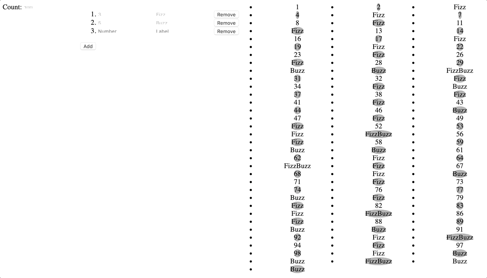

Front end code review exercise
==============================


What is this?
=============

"FizzBuzz" is a classic interview question demonstrating competency with loops and I/O.

The specification is:
> "For each number 1-100, if the number is divisible by 3 print 'Fizz', if it's divisible by 5 print 'Buzz', and if it's divisible by both print 'FizzBuzz'. If the number isn't divisible by either term just print the number."

So, the output looks like:
```
1
2
Fizz
4
Buzz
Fizz
7
[...snip...]
14
FizzBuzz
16
[...snip...]
99
Buzz
```

This repo has this implemented in the form of an API endpoint. It takes `begin` and `end` parameters and returns JSON describing the labels for each number from `begin`-`end` inclusive.

The API also accepts different rules for how to label divisible numbers. The classic scheme described above is coded as `[[3, 'Fizz'], [5, 'Buzz']]`, but you could supply any number of `[integer, string]` tuples to label the list accordingly.

You can assume that this API works well enough, though you are welcome to take a look and critique it.


The aim here is to debug the new web components comprising the front-end to this API.




Setup:
======

 1. `git clone https://github.com/steve-rescale/code-review.git`
 2. `cd code-review`
 3. `git checkout -b code-review --track origin/code-review`
 4. `npm install` - global deps
 5. `npm run bootstrap` - package deps
 6. `npm run build` or `npm run watch` - transpile packages
 7. `npm start` - launch web server

 Visit `http://localhost:3000` in your browser.


Native Web Components
====================

The components here use the W3C web components API, which is similar to reactive binding frameworks like React, Vue, Polymer, etc.

These are objects that extend from `HTMLElement`, which can be assigned tag names to use in markup:

```javascript
class MyCustomButton extends HTMLElement {...}
window.customElements.define('my-custom-button', MyCustomButton);
```

Then, elsewhere:
```html
<form>
  <my-custom-button foo="bar">Click me!</my-custom-button>
</form>
```

The interface for `HTMLElement` is relatively simple:

## `connectedCallback()`

Called when the element is stamped into the DOM.

## `static get observedAttributes()`

This returns a `[ 'list', 'of', 'attribute', 'names' ]` that the component is interested in observing. Attributes have similarities to both `props` and `state` in React. They're being used like `props` here, passing data into components through HTML.

Attributes that are observed call:

## `attributeChangedCallback(attributeName, oldValue, newValue)`

Here you respond to the data by whatever means necessary. Usually this involves doing some manipulation of the DOM inside the component, so you can think of it as also being the `render` method.

Having not included a templating libary here, DOM manipulation is done the "old fashioned" way: `cloneNode`-ing elements, `createElement`/`appendChild` to build up a list, all that fun stuff from back even before we even had jQuery.

## `dispatchEvent(event)`

In the absence here of a central store, data is exchanged "props down, events up".

Components can assign their children properties, and if child components need to communicate back up the tree, they can emit an event with that data. Any interested parties upstream can `addEventListener` to subscribe.


Questions
=========

 * Does the code do what it's meant to? What are the edge cases, and are they accounted for? Is there anything a user could do to end up with an error or an inconsistent or misleading state?

 * Does the broad approach make sense, or are there things that should be refactored to operate differently?

 * Is the code of good quality? Are there any bugs, dead code, unclear code, needless indirections, typos, unsafe assumptions, deliberate obfuscations?

 * Is the presentation good? Is it obvious how to use the application and easy to interpret the results?

