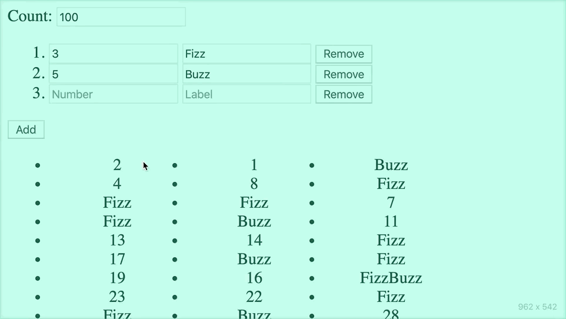

Front end code review exercise
==============================


What is this?
=============

"FizzBuzz" is a classic interview question demonstrating competency with loops and I/O.

The specification is:
> "For each number 1-100, if the number is divisible by 3 print 'Fizz', if it's divisible by 5 print 'Buzz', and if it's divisible by both print 'FizzBuzz'. If the number isn't divisible by either term just print the number."

So, the output looks like:
```
1
2
Fizz
4
Buzz
Fizz
7
[...snip...]
14
FizzBuzz
16
[...snip...]
99
Buzz
```

This repo has this implemented in the form of an API endpoint. It takes `begin` and `end` parameters and returns JSON describing the labels for each number from `begin`-`end` inclusive.

Due to feature creep, the API can now also accept different rules for how to label divisible numbers. The prototypical scheme described above is coded as `[[3, 'Fizz'], [5, 'Buzz']]`, but you could supply any number of `[integer, string]` tuples to label the list accordingly.

You can assume that this API works well enough, though you are welcome to take a look and critique it.


The focus is on the web components comprising the interface to this API, collecting the pertinent parameters and displaying the output. It sorta works, but has some rough edges to consider code-wise, and ...debatable stylistic presentation.




Setup:
======

 1. `git clone https://github.com/steve-rescale/code-review.git`
 2. `cd code-review`
 3. `git checkout -b code-review --track origin/code-review`
 4. `npm install` - global deps
 5. `npm run bootstrap` - package deps
 6. `npm run build` or `npm run watch` - transpile packages
 7. `npm start` - launch web server

 Visit `http://localhost:3000` in your browser.


Native Webcomponents
====================

These components are built with the web components spec implemented in Chrome. It's similar to other reactive binding frameworks like React, Vue, Polymer, etc, but with a more minimal API.

Native components extend `HTMLElement` to add new tags the HTML vernacular:

```javascript
class MyCustomButton extends HTMLElement {...}
window.customElements.define('my-custom-button', MyCustomButton);
```

Then, elsewhere:
```html
<form>
  <my-custom-button foo="bar">Click me!</my-custom-button>
</form>
```

The component behavior is implemented by defining some lifecycle events in the class:

## Lifecycle

### `constructor()`

This is like `componentDidMount`, or `jQuery.ready`, signaling that you can start changing the document. The document in this case is a "shadow root", which has all the same properties as the global `document` object but which is encapsulated to the scope of your component. Each component is essentially its own little web page. Or think of it like `chroot` for the DOM.

Here, in `constructor` we load `template.html` into the document, then use the familiar `getElementById`/`querySelector` DOM methods to save references to elements we need to update in response to state changes. This is also a good place to `addEventListeners` to template elements which are interactive.

### `static get observedAttributes()`

This returns a `[ 'list', 'of', 'attribute', 'names' ]` that the component is interested in observing. This is similar to your list of `props` in React. Attributes are defined directly in the HTML template as above or programmatically with `setAttribute`. The observed list ties directly to:

### `attributeChangedCallback(attributeName, oldValue, newValue)`

This is like `componentWillReceiveProps`, except that it's called once with each changed attribute rather than with a collection of them all.

Here you respond to the data by whatever means necessary. Usually this involves doing some manipulation of the DOM inside the component, so you can think of it as also being the `render` method.

Having not included a templating libary here, DOM manipulation is done the "old fashioned" way: `cloneNode`-ing elements, `createElement`/`appendChild` to build up a list, all that fun stuff from back even before we even had jQuery.


## Events

Data flow is "attributes down, events up".

Just like a plain `<input>` emits `change`, `keypress`, `click`, etc, components can emit `CustomEvent`s with an arbitrary payload describing state changes. This happens once here, when the rule set component `change`s, with the outer component listening to update its list accordingly.


Layout
======

`packages/front-end/src` and `packages/server/src` contain the relevant code. `lib/` in each package holds compiled code.

The `src/` files are TypeScript, but the type annotations are intended to be good enough as-written. You can use them as cues about data flow or ignore them.


Questions
=========

 * Does the code do what it's meant to? What are the edge cases, and are they accounted for? Is there anything a user could do to end up with an error or an inconsistent or misleading state?

 * Does the broad approach make sense, or are there things that should be refactored to operate differently?

 * Is the code of good quality? Are there any bugs, dead code, unclear code, needless indirections, typos, unsafe assumptions, deliberate obfuscations?

 * Is the presentation good? Is it obvious how to use the application and easy to interpret the results?

